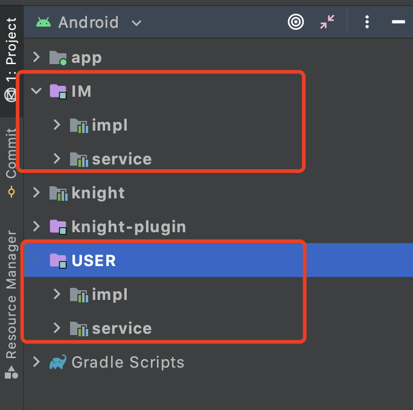

# 实现原理

在了解了 Knight 的基本用法后，发现接口和实现类都是依靠注解去标记的，然后在调用 api 方法时，通过接口找到对应的实现类，并把
实现类自动实例化。这就是框架的基本原理。如何做到的？

比如，我们有接口 IUser，IMessage，实现类 UserImpl 和 MessageImpl。那么如果有一个类将它们的关系映射下来，就很容易实现了：


```java
public interface IServiceManager {
    HashMap<String, String> getServiceImplMap();
}

public class KnightServiceManager implements IServiceManager {
    private static final HashMap<String, String> serviceImplMap = new HashMap();

    public KnightServiceManager() {
    }

    @Override
    public HashMap<String, String> getServiceImplMap() {
        return serviceImplMap;
    }

    static {
        serviceImplMap.put("com/user/service/IUser_KnightDefault", "com/user/impl/UserImpl");
        serviceImplMap.put("com/message/service/IMessage_KnightDefault", "com/message/impl/MessageImpl");
    }
}
```
如上所示，如果将接口和对应的实现类映射到一个 map 中，那么就可以根据接口在 map 中找到对应的实现类，并且调用其方法了。

Knight 的实现就是围绕着如何生成 KnightServiceManager 这个类去进行的。

实现技术这里主要选用了 ASM+gradle插件 去实现，具体逻辑可以查看代码。主要逻辑在 AnnotationClassVisitor 这个类中。

首先我们需要两个 Map 去存储扫描出来的被注解标记的类：

```kotlin
private val serviceMap: HashMap<String, String>,
private val serviceImplMap: HashMap<String, String>
```

然后扫描注解类，如果注解等于 @KnightImpl 或者 @KnightService 时，就根据条件将他们插入到对应的 map 中。
扫描结束后，通过字节码动态生成 KnightServiceManager 类，逻辑在 KnightByteCodeWriter 中。

模块化例子：

加入工程里面有两个模块，IM 模块和用户模块，每个模块应该要分出一个对外提供功能的接口模块，和一个具体实现的模块


